# User Guide

## Prerequisites

Start Authelia (downloads the binary and generates a TLS certificate automatically):

```bash
xplat task authelia:start
```

To start fresh (reset all data including 2FA registrations):

```bash
xplat task authelia:reset
xplat task authelia:start
```

Several flows require a one-time code for identity verification. In dev mode, codes are written to a file instead of sent by email:

```bash
cat .data/authelia/notification.txt
```

**URLs (localhost):**
- Login: <https://127.0.0.1:9091>
- Settings: <https://127.0.0.1:9091/settings>
- 2FA Settings: <https://127.0.0.1:9091/settings/two-factor-authentication>
- Password Reset: <https://127.0.0.1:9091/reset-password/step1>
- API (Swagger UI): <https://127.0.0.1:9091/api/>

### Mobile / Remote Access

Access Authelia from any device via **Cloudflare Tunnel** — public HTTPS URL with a valid certificate, no setup needed on the device.

```bash
xplat task authelia:tunnel
```

A public URL will appear (e.g. `https://xxx.trycloudflare.com`). Open it on your phone or any browser — works immediately with no cert warnings.

> **Note:** The URL changes each time you restart the tunnel. No Cloudflare account needed.

### Auth Flow Modes

Switch between flows using the `AUTH_FLOW` variable:

```bash
# 2FA required (register TOTP or WebAuthn, then use it to login)
xplat task authelia:tunnel

# Password only (skip 2FA — useful for basic testing)
xplat task authelia:tunnel:1fa

# Fresh start (wipe DB so you can re-register 2FA from scratch)
xplat task authelia:reset
xplat task authelia:tunnel
```

Flow configs are in `systems/authelia/flows/`. Add your own YAML overlay to create custom flows.

## 1. Sign In

Open <https://127.0.0.1:9091> (or the tunnel URL on mobile) and enter `admin` / `admin`.

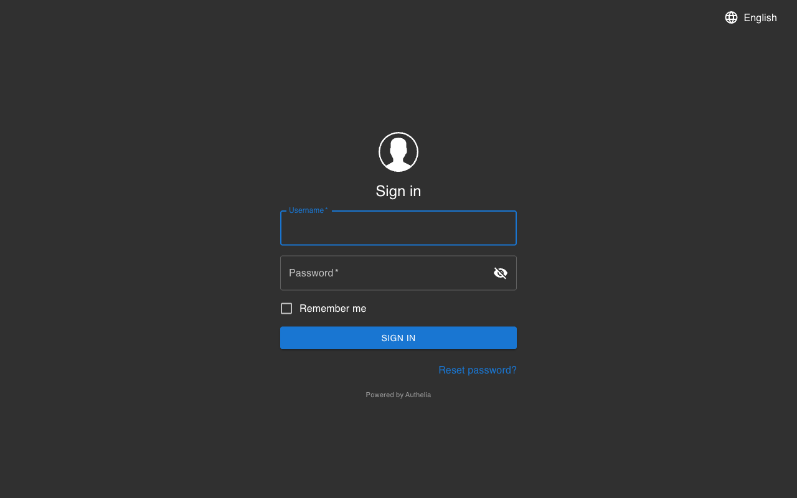

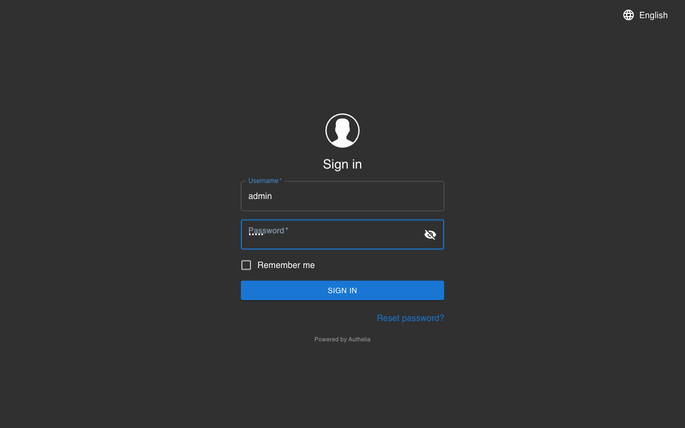

On first login (no 2FA configured yet), you'll be prompted to register a device.

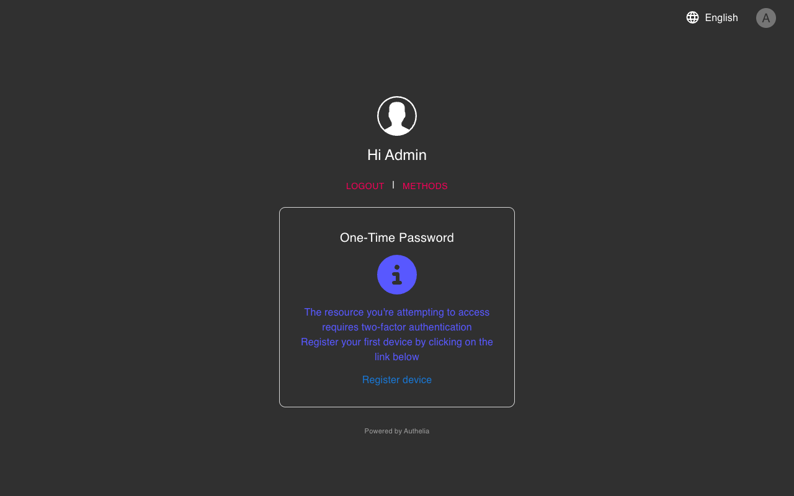

## 2. Two-Factor Authentication Setup

You need to register at least one second factor. Choose the method that works best for you:

| Method | What you need | Codes? | Platforms |
|--------|--------------|--------|-----------|
| **Option A:** [TOTP with authenticator app](#2a-totp-with-authenticator-app) | Google Authenticator, Authy, etc. | 6-digit code each login | All platforms |
| **Option B:** [TOTP with Apple Passwords](#2b-totp-with-apple-passwords) | No app install needed | 6-digit code (auto-filled by Safari) | Apple only (iOS 15+, macOS Monterey+) |
| **Option C:** [Passkey / Biometrics (WebAuthn)](#2c-passkey--biometrics-webauthn) | Touch ID, Face ID, or fingerprint sensor | No codes — just your biometric | Apple (Touch ID/Face ID), Android (fingerprint/face), security keys |

> **Tip:** You can register multiple methods. For example, set up TOTP first, then add Touch ID as well. You can also register both at once.

### Identity Verification

All registration flows require identity verification first. When prompted, check the notification file for your one-time code:

```bash
cat .data/authelia/notification.txt
```

Enter the 8-character code in the dialog and click **Verify**.

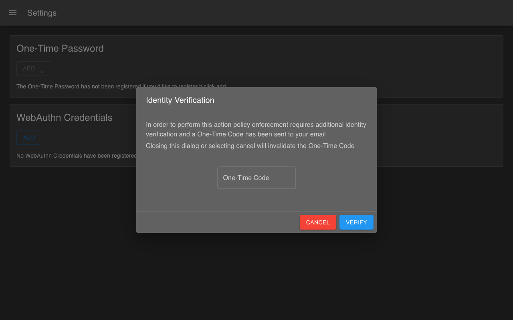

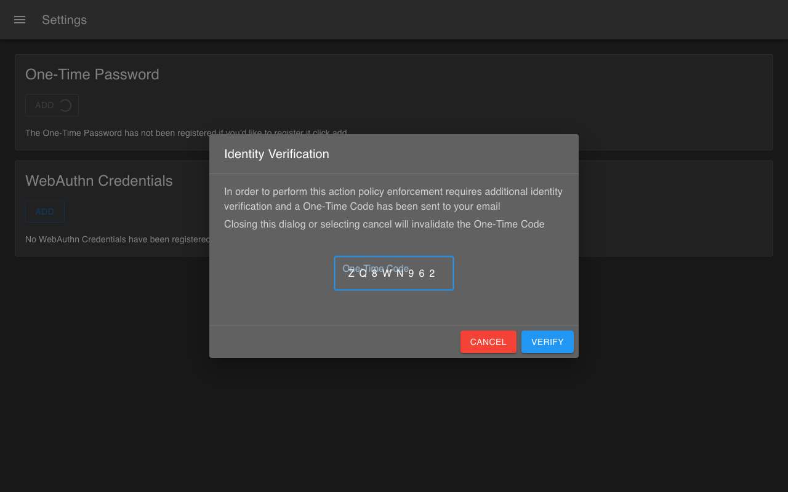

---

### 2a. TOTP with Authenticator App

Click **Register device** (or **Add** next to One-Time Password in [Settings → Two-Factor Authentication](https://127.0.0.1:9091/settings/two-factor-authentication)).

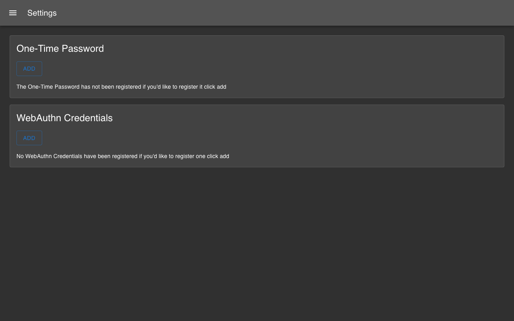

Complete [identity verification](#identity-verification) if prompted.

The TOTP registration wizard starts. Click **Next** to proceed.


Scan the QR code with your authenticator app (Google Authenticator, Authy, etc.).

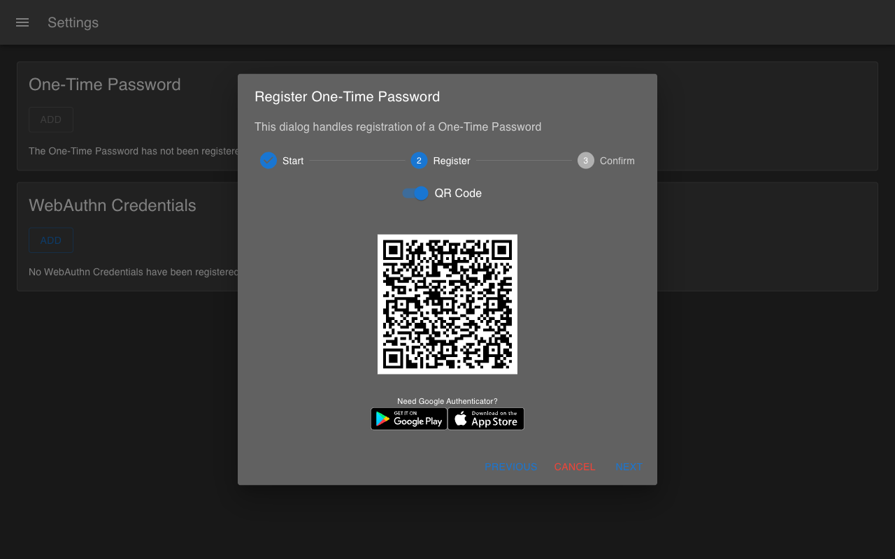

Enter the 6-digit token from your authenticator app to confirm.

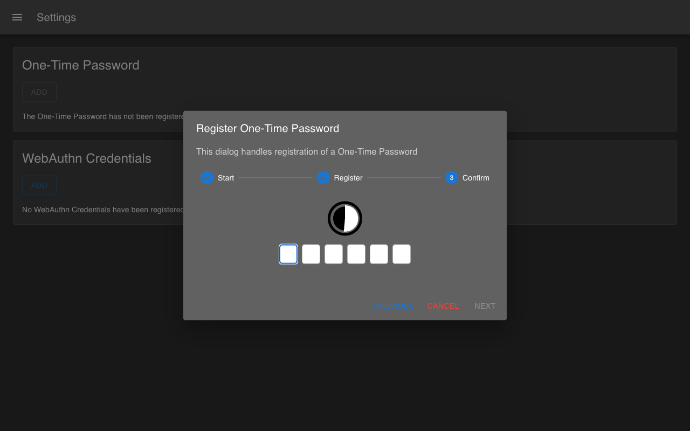

TOTP is now registered.

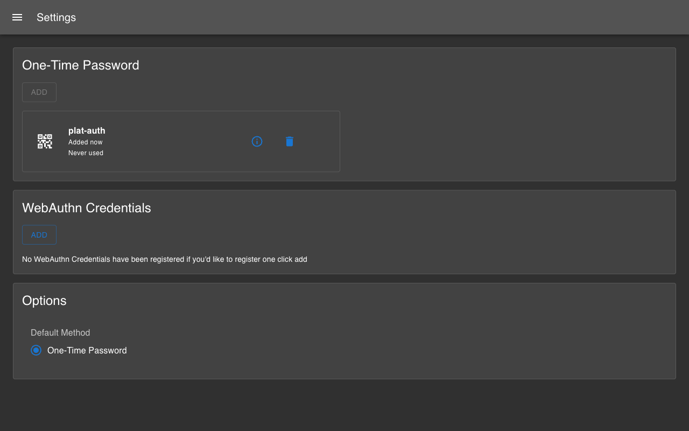

---

### 2b. TOTP with Apple Passwords

This is the same TOTP flow as Option A, but instead of a third-party app you use Apple's built-in **Passwords** app. No app install needed.

1. Follow the same steps as [Option A](#2a-totp-with-authenticator-app) until the QR code appears
2. Open the **Passwords** app (macOS Sequoia+) or go to **System Settings → Passwords**
3. Create a new entry or select an existing one for `127.0.0.1`
4. Click **Set Up Verification Code...** and scan the QR code from the Authelia page
5. The Passwords app now generates TOTP codes automatically
6. Enter the 6-digit code shown in Passwords to confirm registration

On future logins, Safari will auto-fill the TOTP code — no need to open an app or type anything.

---

### 2c. Passkey / Biometrics (WebAuthn)

WebAuthn lets you use biometrics as your second factor — no codes at all.

- **macOS:** Touch ID
- **iOS:** Face ID or Touch ID
- **Android:** Fingerprint or face unlock
- **Any platform:** USB/NFC security key (YubiKey, etc.)

> **Note:** You must register TOTP first (Option A or B), then add WebAuthn as an additional method. This is because you need to be fully authenticated to access settings.

In [Settings → Two-Factor Authentication](https://127.0.0.1:9091/settings/two-factor-authentication), click **Add** next to WebAuthn Credentials.

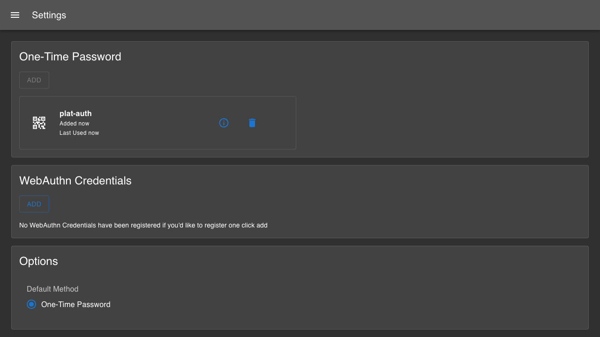

Complete [identity verification](#identity-verification) if prompted.

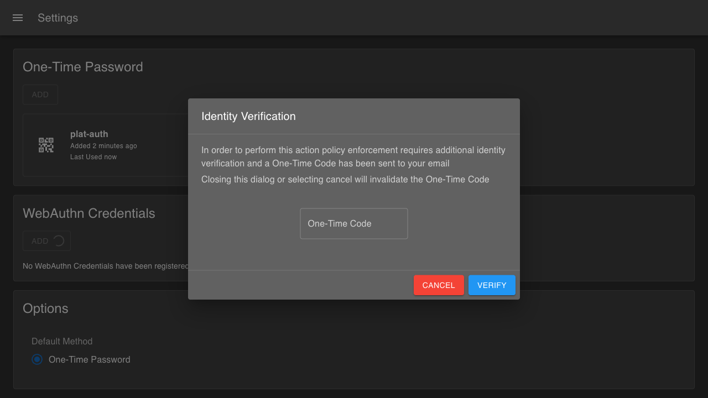

Enter a description for the credential (e.g. "Touch ID - MacBook" or "Pixel Fingerprint") and click **Next**.

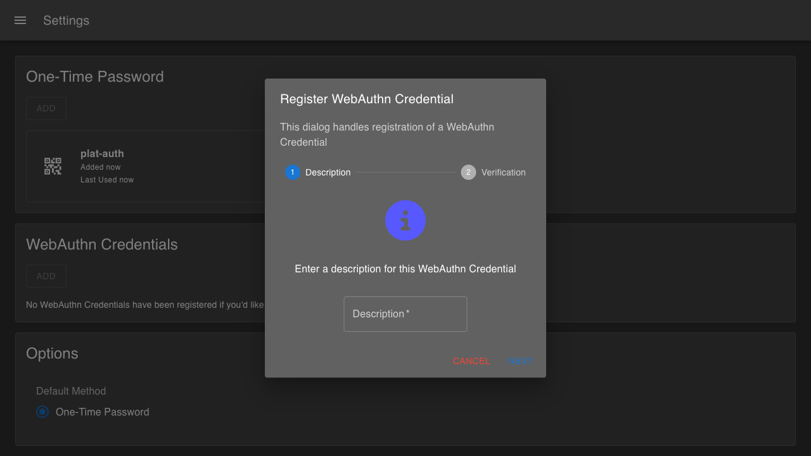

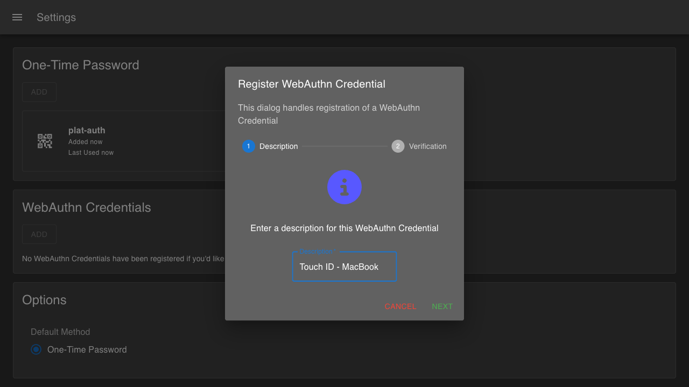

Your browser will show a native prompt to verify with your biometric. Authenticate to complete registration.

<!-- TODO: Add screenshot of Touch ID prompt (must be captured manually — see below) -->

> **Tip:** On Apple devices, passkeys sync via iCloud Keychain — register on your Mac, use on your iPhone. On Android, passkeys sync via Google Password Manager.

On future logins, you'll be able to use your biometric instead of entering a 6-digit code.

## 3. Two-Factor Login

After registering a second factor, subsequent logins require verification.

**With TOTP:** Enter the 6-digit code from your authenticator app or Apple Passwords.

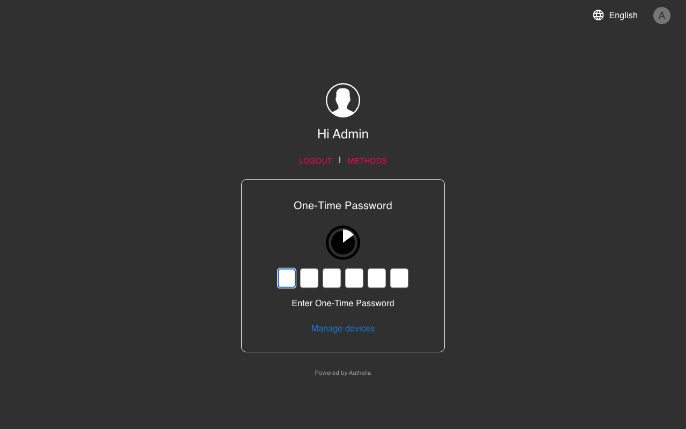

Enter the code and click **Sign in**.


**With WebAuthn:** If you registered a WebAuthn credential, your browser will prompt for Touch ID / Face ID instead.

## 4. Password Reset

Click **Reset password?** on the [login page](https://127.0.0.1:9091), or go directly to <https://127.0.0.1:9091/reset-password/step1>.

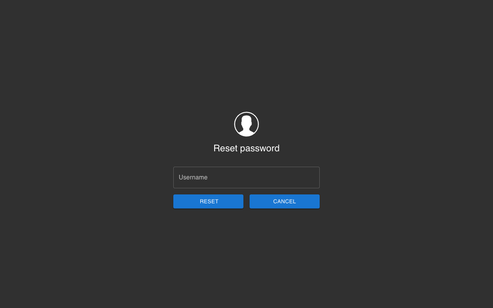

Enter your username and click **Reset**. A reset link is sent to the filesystem notifier.

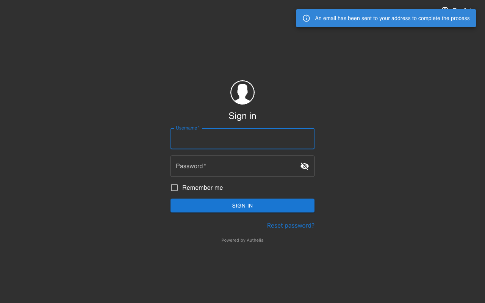

Check `.data/authelia/notification.txt` for the reset link and follow it to set a new password.

## 5. Settings

Access settings via **Manage devices** on the authenticated page, or navigate directly:

- [Settings](https://127.0.0.1:9091/settings)
- [Two-Factor Authentication](https://127.0.0.1:9091/settings/two-factor-authentication)


The Two-Factor Authentication page lets you manage TOTP and WebAuthn credentials.


## 6. Logout

Click **Logout** to end your session.

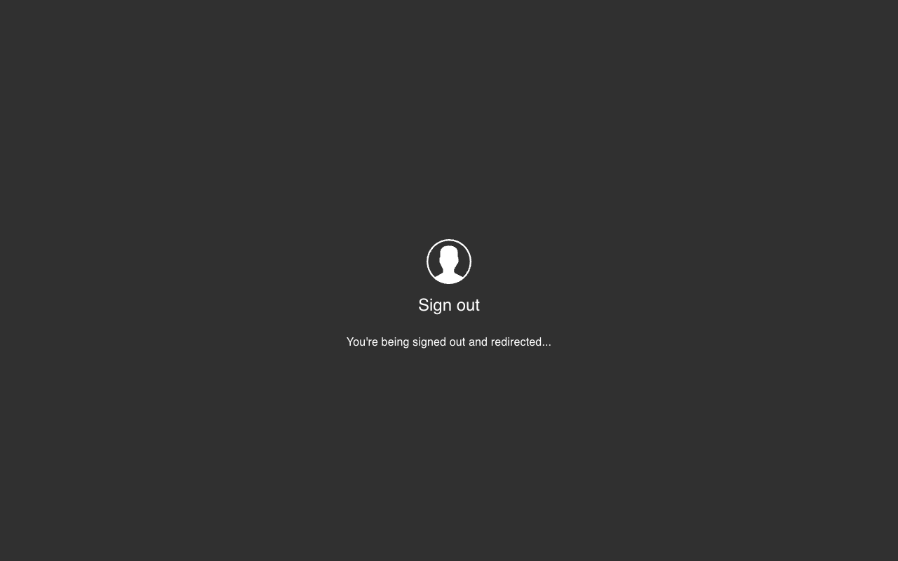

---

## Screenshots Needed

The following screenshots require manual capture (native OS prompts that can't be automated):

### WebAuthn / Touch ID (Section 2c)

1. **Touch ID prompt on macOS** — After clicking **Next** in the WebAuthn wizard, macOS shows a native Touch ID dialog. Take a screenshot (`Cmd+Shift+3`) and save to:
   `docs/screenshots/07-webauthn-setup/05-touchid-prompt.png`

2. **WebAuthn registered confirmation** — After Touch ID succeeds, screenshot the settings page showing the new credential. Save to:
   `docs/screenshots/07-webauthn-setup/06-webauthn-registered.png`

3. **WebAuthn login prompt** — On next login, when prompted for 2FA, screenshot the Touch ID prompt. Save to:
   `docs/screenshots/07-webauthn-setup/07-webauthn-login-prompt.png`

After capturing, remove the `<!-- TODO -->` comments from this guide and replace them with the corresponding `` image references.
